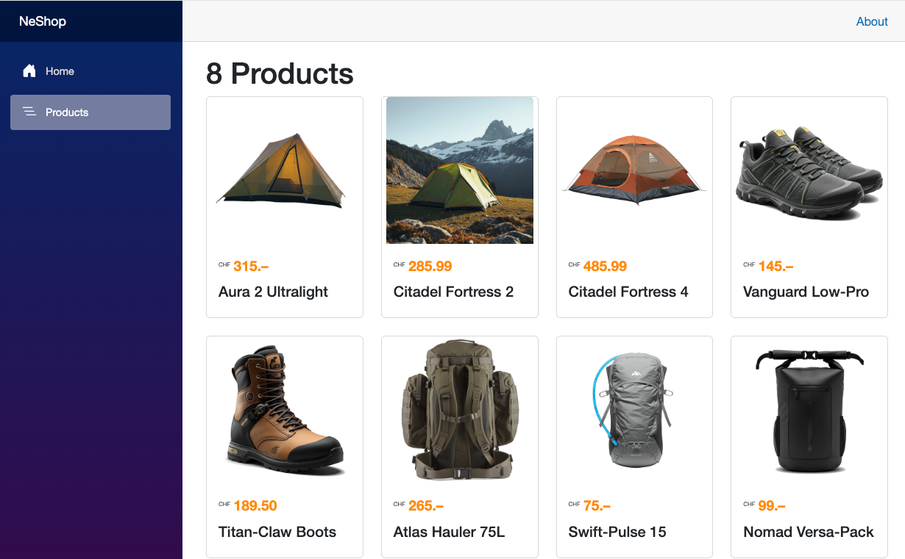
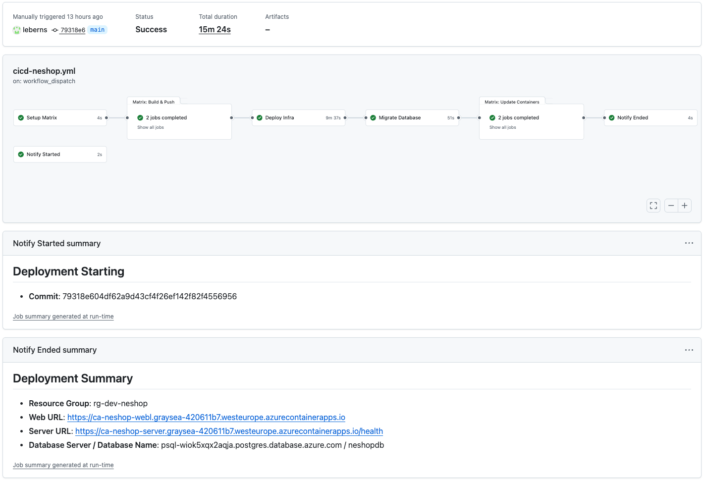

# NeShop

This project aims to deploy an application with all three tiers (frontend / backend / database) from GitHub to Azure.

The demo application is an online e-commerce shop: NeShop, but it could be your application, if you like to replace the code.

## Points of interest

- **On Budget**: no expensive databases or resources are provisioned on Azure, good for students or individuals
- **Deployment fully automated** with GitHub Actions: frontend, backend, database
- Resources provisioned with **infrastructure as code**: **Bicep**
- **No passwords needed**: the application uses managed identities to access the database
- Database: PostgreSQL
- Database migrations with **efbundle** from container
- Backend: ASP.NET Core WebAPI
- Frontend: Web/BlazorServer
- [Azure Container Apps](https://learn.microsoft.com/en-us/dotnet/core/containers/overview?tabs=linux) (= ACA)
- Container registry: DockerHub
- Images and test content created with AI

## The project

Example of the application running on Azure:

GitHub Actions workflow deploying to Azure, an execution example:

## Next steps

Pick an interest and follow along.

- [Getting Started - Deploying to Azure](./docs/01-getting-started-deploying-to-azure.md)
