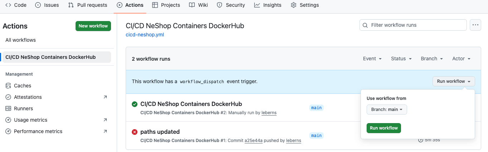
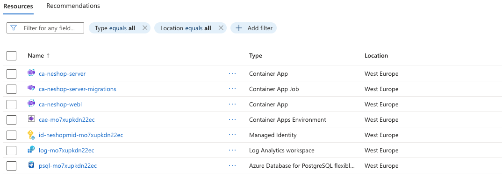

# Getting Started - Deploying to Azure

How to deploy from your GitHub repository to your Azure account.

## Prerequisites

- [Azure](https://azure.microsoft.com/) free or pay-as-you-go account
- [GitHub](https://github.com/) account and repository called "neshop-aca"
- [DockerHub](https://hub.docker.com/) account and repository called "neshop"
- [Azure CLI](https://learn.microsoft.com/en-us/cli/azure/install-azure-cli?view=azure-cli-latest)

## Prepare your GitHub repository

Clone / download the repository and copy the content to your repository "neshop-aca" on GitHub.

It is assumed your repository will be under an `~/Dev` folder on Linux / MacOS.

On Windows just replace `~/Dev` by a path like `D:\Dev` in the scripts.

```Sh
# get the code with "git clone" and copy to your repository at ~/Dev
git clone https://github.com/leberns/neshop-aca.git
```

Make sure to push what is in `~/Dev/neshop-aca` to your repository on GitHub.

## Configure the identity on Azure for the deployments

The GitHub Actions need an identity on Azure so that it can deploy create or update resources on Azure (databases, container apps, etc).

The identity is authorized at subscription level, so that it can create resource groups and also assign roles to the managed identities.

This script creates the identity on Azure.

Please review it's values before executing it.

```Sh
cd ~/Dev/neshop-aca/src/tools/

# make the script executable, if needed
chmod +x ./set-oidc-github-azure.sh

# review the variables `GITHUB_REPO` and `FC_SUBJECT` and execute
./set-oidc-github-azure.sh
```

The script is idempotent, if it fails you can modify it and run again.

The script outputs a few values, add them as secrets to the GitHub Repo, for example:

```
Add the following secrets to GitHub (<the repo> > Settings > Secrets and variables > Actions > New repository secrets):
AZURE_CLIENT_ID        = <guid>
AZURE_TENANT_ID        = <guid>
AZURE_SUBSCRIPTION_ID  = <guid>
```

Do not copy/paste the values with spaces.

With this done, the GitHub Actions can now deploy from your neshop-aca repository, main branch, on your Azure subscription.

## Prepare access to the container images on Docker Hub

So that the container images on Docker Hub can be updated and used in deployment workflows from GitHub Actions.

Make sure to have:

- your Docker Hub `<dockerhub_username>`
- your GitHub `<github_username>` and repository `<github_repository>`.

Prepare a personal access token (PAT) in Docker Hub with **Read/Write** access:

- https://app.docker.com/ > Settings > Personal access tokens > Generate new token

  Description: Push pull images from GitHub neshop-aca

  Access permissions: Read & Write

  Copy the personal access token, it will not be available later.

In the GitHub repository, set the secrets:

<the repo> > Settings > Secrets and variables > Actions > New repository secrets

```
DOCKERHUB_USERNAME: <dockerhub_username>
DOCKERHUB_TOKEN: <the PAT> (ex.: dckr_pat_123...)
```

## Configure Database users for deployment

The application uses **managed identities** to access the database, so the application do not have access to any fixed passwords.

The developer / db administrator uses the Azure Entra ID account, also they do not have access to any fixed passwords.

The only situation that neededs an database administrator and password is to execute the migration jobs from a container, at the moment.

These Entra ID accounts and admin users have to be set in GitHub as secrets, so that they can be provisioned in the database, otherwise no person can access it.

<the repo> > Settings > Secrets and variables > Actions > New repository secrets

- `POSTGRESQL_ENTRA_ADMIN_NAME`: <azure-account-email> - ex.: my-account-email@outlook.com on Entra ID

  Command to find the logged-in Azure account user:

  ```Sh
  az account show --query user.name -o tsv
  ```

- `POSTGRESQL_ENTRA_ADMIN_OBJECT_ID`: <guid> - the user object id on Entra ID

  Command to find the user object id:

  ```Sh
  az ad signed-in-user show --query id -o tsv
  ```

- `POSTGRESQL_ADMIN_LOGIN`: posadmin - some classic admin user to be created on the database server, used by the migrations

- `POSTGRESQL_ADMIN_PASSWORD`: pospa$$w0RD - password for the classic admin user, choose a complex password

## Updating the GitHub Actions workflow

Review the GitHub Actions workflow: `~/Dev/neshop-aca/.github/workflows/cicd-neshop.yml`

Check the `AZURE_LOCATION`, update it accordingly or leave it for now like it is.

Please note that not all Azure resources are available on every location.

## Starting the deployment manually

<the repo> > Actions > Secrets and variables > Actions > New repository secrets

Where to go to start the deployment manually: "Run workflow"



When the deployment finishes the URL to open the application is be available in the workflow summary, just open the workflow to see it.

The resources should have been created, can be checked in the [Azure Portal](https://portal.azure.com/).

Resource group name: `dev-neshop-aca`


